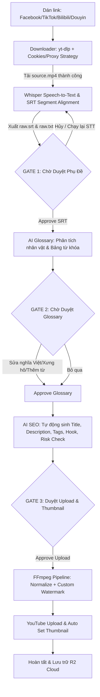

# ✦ VidLocal Studio (Viseon AI Studio)

[](https://github.com/LBT-AI/VidLocal)
[](https://github.com/LBT-AI/VidLocal)
[](#)
[](#)

**VidLocal Studio** (developed under **Viseon AI** for **LETAN Media**) is an enterprise-grade automated video localization, translation, and cross-platform publishing pipeline. It enables content creators and media managers to ingest videos from Chinese and global platforms (Douyin, Bilibili, TikTok, Facebook), perform AI-powered speech-to-text, translate and align cultural nuances (using localized glossary rules and customized pronoun styles), automatically optimize SEO metadata, apply watermarks, and schedule private publishing to YouTube with custom thumbnails.

---

## 📌 Tags & Metadata
- **Project Name:** VidLocal Studio / Viseon AI Studio
- **Organization:** `LETAN Media`
- **Core Technology:** `Viseon AI`, `Python 3.11`, `FastAPI`, `Celery`, `Next.js 14 (TypeScript)`, `PostgreSQL`, `Redis`, `Docker Compose`, `FFmpeg`, `yt-dlp`, `OpenAI Whisper`
- **Target Keywords:** `video-localization`, `auto-translation`, `whisper-stt`, `glossary-alignment`, `youtube-uploader`, `telegram-miniapp`

---

## ⚙️ Sơ đồ Quy trình Hoạt động (Workflow Architecture)

Hệ thống hoạt động theo mô hình **AI-Agent với Human-in-the-loop** (Quy trình tự động hóa có kiểm duyệt của con người ở các bước trọng yếu):



---

## 🚀 Các Tính Năng Cốt Lõi (Key Features)

### 1. Multi-Platform Video Ingestion
- **Platform hỗ trợ:** Facebook Reels/Videos, TikTok Global, Bilibili, Douyin.
- **Cơ chế Cookie bảo mật:** Tự động nạp cookies Netscape để vượt qua các thuật toán chặn tải của Douyin/Bilibili một cách an toàn mà không làm rò rỉ thông tin đăng nhập.
- **Storage & Backup:** Tự động đồng bộ và sao lưu tệp thô gốc lên Cloudflare R2 để tối ưu bộ nhớ máy chủ.

### 2. Speech-to-Text & SRT Review Gate (Phase 2)
- Tích hợp Whisper AI nhận diện giọng nói đa ngôn ngữ (tiếng Trung, Anh, v.v.).
- Chuyển đổi timestamp Whisper sang định dạng thời gian phụ đề chuẩn chỉnh (`HH:MM:SS,mmm`) xuất ra tệp `raw.srt`.
- **Review Gate:** Hệ thống dừng xử lý ngay sau khi STT xong, hiển thị khung đọc phụ đề thô trực quan trên Mini App và đẩy file SRT về Telegram để admin duyệt hoặc chọn thử lại riêng bước STT (không cần tải lại video).

### 3. Interactive Glossary Editor (Phase 3)
- Tự động trích xuất các danh từ riêng, tên nhân vật, địa điểm thông qua LLM.
- **Interactive UI (Mini App):** Cho phép sửa nghĩa tiếng Việt trực tiếp, chọn ngữ cảnh xưng hô chuẩn truyện dịch (Ví dụ: *ta / ngươi*, *tỷ / muội*, *huynh / đệ*, *hắn*, *nàng*...) bằng thanh lựa chọn trực quan, thêm từ mới hoặc xóa từ không cần thiết.
- **Auto-Sync:** Mọi thay đổi đều được lưu trực tiếp vào cơ sở dữ liệu trên mỗi hành động của người dùng (onBlur / onChange).

### 4. Smart SEO & Upload Control
- AI sinh tiêu đề chuẩn SEO (< 90 ký tự), mô tả chi tiết, hashtag, và kiểm tra mức độ rủi ro bản quyền của video.
- Upload YouTube tự động ở chế độ `private`, tự động đồng bộ ảnh thu nhỏ (Thumbnail) đã chọn.

### 5. Dual Management Interfaces (Bot & Mini App)
- **Telegram Bot:** Tối giản, sang trọng theo tông màu Luxury Dark-Mode, hỗ trợ xem thông tin tệp chi tiết, gửi tài liệu SRT trực tiếp và inline keyboard duyệt nhanh.
- **Next.js Mini App:** Đẹp mắt, mượt mà, responsive tốt trên các thiết bị di động, hiển thị trạng thái và % tiến trình của từng bước xử lý theo thời gian thực (real-time polling hash diff).

---

## 🛠️ Công Nghệ Sử Dụng (Technology Stack)

### Backend
- **Framework:** FastAPI (Python 3.11)
- **Database ORM:** SQLAlchemy + Alembic (PostgreSQL)
- **Task Queue:** Celery + Redis
- **Media Engine:** FFmpeg + yt-dlp
- **AI Integration:** OpenAI API (GPT & Whisper Models)
- **Bot Engine:** `python-telegram-bot` v20+

### Frontend
- **Framework:** Next.js 14 (TypeScript / App Router)
- **Styling:** Tailwind CSS + Custom Dark Glassmorphism CSS
- **State Management:** React Hooks (useEffect, useState, useRef)
- **Integration:** Telegram WebApp SDK (TMA)

---

## 📦 Hướng Dẫn Cài Đặt & Khởi Chạy (Installation & Setup)

### Yêu cầu hệ thống
- Docker & Docker Compose cài đặt sẵn.
- Hệ điều hành Linux (Ubuntu/Debian) hoặc Windows Docker Desktop.
- Một bot token Telegram (tạo từ @BotFather).

### 1. Cấu hình biến môi trường
Tạo tệp `.env` tại thư mục gốc dựa trên tệp `.env.example`:

```env
# Database & Redis
POSTGRES_DB=vidlocal
POSTGRES_USER=postgres
POSTGRES_PASSWORD=your_password
REDIS_URL=redis://redis:6379/0

# API & Security
JWT_SECRET=your_jwt_secret_key
ADMIN_TELEGRAM_ID=1208342332

# Bot Telegram & API Keys
TELEGRAM_BOT_TOKEN=your_telegram_bot_token
OPENAI_API_KEY=your_openai_api_key

# Storage & Path
PROJECT_DATA_DIR=/app/data
BILIBILI_COOKIES_FILE=/app/cookies/bilibili.txt
DOUYIN_COOKIES_FILE=/app/cookies/douyin.txt
```

### 2. Cấu hình Cookie cho Downloader
Đặt các tệp cookies Netscape định dạng `.txt` vào thư mục:
- Bilibili: `cookies/bilibili.txt`
- Douyin: `cookies/douyin.txt`

### 3. Khởi chạy dự án bằng Docker Compose
Khởi chạy toàn bộ container (API, Celery Worker, Redis, Postgres, Telegram Bot, Next.js Frontend) bằng lệnh:

```bash
docker compose up -d --build
```

Kiểm tra trạng thái các container:
```bash
docker compose ps
```

---

## 📊 Mô Hình Trạng Thái Chuẩn Hóa (Standardized Status Model)

Hệ thống phân tách trạng thái tổng (`status`) và bước thực thi hiện tại (`current_step`) để đảm bảo không bị xung đột trạng thái:

| `status` (Trạng thái tổng) | `current_step` (Bước xử lý) | `review_state` (Trạng thái chờ duyệt) | Ý nghĩa |
|---|---|---|---|
| `pending` | `download` | `none` | Đang xếp hàng chờ xử lý |
| `running` | `download` | `none` | Đang tải tệp video thô |
| `running` | `transcribe` | `none` | Đang chạy Speech-to-Text (Whisper) |
| `waiting_review` | `transcribe` | `waiting_srt` | Đã xong STT, dừng lại chờ duyệt phụ đề |
| `running` | `character_extract` | `none` | Đang trích xuất nhân vật/glossary |
| `waiting_review` | `character_extract` | `waiting_glossary`| Dừng lại chờ duyệt Glossary trên UI/Bot |
| `running` | `seo_metadata` | `none` | Đang tối ưu hóa SEO bằng AI |
| `waiting_review` | `seo_metadata` | `waiting_upload` | Dừng lại chờ duyệt Thumbnail & Upload |
| `running` | `watermark` | `none` | Đang render đóng dấu (FFmpeg) |
| `running` | `upload` | `none` | Đang tải lên kênh YouTube |
| `completed` | `upload` | `none` | Dự án hoàn tất thành công |
| `failed` | `[step_lỗi]` | `none` | Bị lỗi tại bước cụ thể |

---

## 🔒 Phân Quyền & Bảo Mật (Access Control)
- Quyền truy cập vào Mini App được xác thực nghiêm ngặt bằng chữ ký số `initData` của Telegram.
- Chỉ người dùng có ID Telegram được cấu hình trong `ADMIN_TELEGRAM_ID` (mặc định: `1208342332` thuộc **LETAN Media**) mới có quyền xem, tạo, sửa đổi và duyệt các dự án.

---

## 📄 Bản Quyền & Phát Triển (License)
Dự án được xây dựng và phát triển độc quyền bởi **Viseon AI** dành cho **LETAN Media**. Mọi quyền được bảo lưu.
